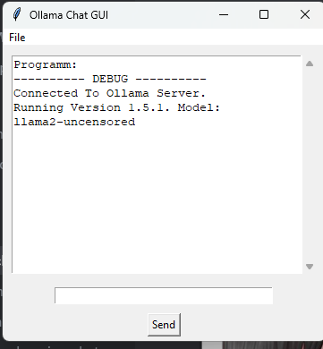

# Ollama Chat GUI

A gui for ollama. 

Image Mode:
<br><br>
<br><br>
<br><br>
Default model: llama2-uncensored


## How to run
```
pip install -r requirements.txt
python main.py
```


(you need to run a ollama server first. download ollama at https://ollama.com then run 'ollama run <your-preferd-model>')

Also if you are using images create a directory named 'images' since it assumes the images are in there


## Configuring
just read the `config.txt`. Its self explaning. But dont put a file extension on the imagePath and only use png's
Also remove the .example from it


